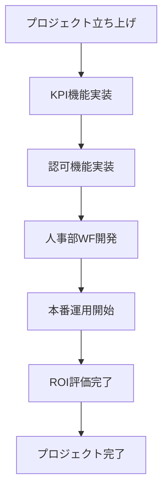

# Work Breakdown Structure (WBS)
## 鴻池運輸株式会社 全社生成AI推進プロジェクト Phase2

**作成日**: 2025年8月12日  
**バージョン**: 1.0  
**関連文書**: プロジェクト憲章 v1.0、プロジェクトスコープ記述書 v1.0  

---

## WBS構成

### 1. プロジェクト管理・基盤整備
**期間**: 2025年7月1日 - 2025年9月30日  
**責任者**: プロジェクトマネージャー

#### 1.1 プロジェクト立ち上げ
- **1.1.1** チームキックオフミーティング（2日）
- **1.1.2** プロジェクト憲章承認（3日）
- **1.1.3** ステークホルダー分析・調整（5日）
- **1.1.4** プロジェクト計画書作成（5日）

#### 1.2 プロジェクト管理
- **1.2.1** 週次定例会議運営（継続的）
- **1.2.2** 進捗管理・報告（継続的）
- **1.2.3** リスク管理（継続的）
- **1.2.4** 品質管理（継続的）

#### 1.3 プロジェクト終了
- **1.3.1** 成果物最終検収（3日）
- **1.3.2** プロジェクト振り返り（2日）
- **1.3.3** 教訓記録作成（3日）
- **1.3.4** プロジェクト終了報告（2日）

---

### 2. 技術基盤強化
**期間**: 2025年7月1日 - 2025年8月15日  
**責任者**: AI/インフラエンジニア

#### 2.1 KPI計測機能実装
**期限**: 2025年7月31日

- **2.1.1** KPI要件定義・設計（5日）
  - 計測対象項目定義
  - ダッシュボード設計
  - データ収集方式設計
- **2.1.2** KPI計測システム開発（10日）
  - データ収集機能実装
  - 集計・分析機能実装
  - ダッシュボード実装
- **2.1.3** KPI機能テスト（5日）
  - 単体テスト
  - 結合テスト
  - システムテスト
- **2.1.4** KPI機能リリース（3日）
  - 本番環境デプロイ
  - 動作確認
  - 運用開始

#### 2.2 認可・権限管理機能実装
**期限**: 2025年8月15日

- **2.2.1** 認可機能要件定義・設計（5日）
  - RBAC設計
  - 権限マトリクス作成
  - 認証フロー設計
- **2.2.2** 認可機能開発（12日）
  - 認証機能実装
  - 権限管理機能実装
  - UI/UX実装
- **2.2.3** 認可機能テスト（5日）
  - セキュリティテスト
  - 権限テスト
  - 統合テスト
- **2.2.4** 認可機能リリース（3日）
  - 本番環境デプロイ
  - 権限設定
  - 運用開始

#### 2.3 セキュリティ強化
**期間**: 2025年7月1日 - 2025年8月15日

- **2.3.1** セキュリティ要件分析（3日）
- **2.3.2** WAF設定・実装（5日）
- **2.3.3** IP制限・アクセス制御（3日）
- **2.3.4** 監査ログ機能実装（7日）
- **2.3.5** セキュリティテスト（5日）
- **2.3.6** セキュリティ運用開始（2日）

---

### 3. 人事部ワークフロー開発
**期間**: 2025年7月15日 - 2025年8月31日  
**責任者**: 人事部+OJT担当者

#### 3.1 健康診断OCRワークフロー
**期限**: 2025年8月31日

- **3.1.1** 業務要件分析（7日）
  - 現行業務フロー分析
  - データフォーマット調査
  - システム要件定義
- **3.1.2** システム設計（5日）
  - OCR処理設計
  - データ変換設計
  - 例外処理設計
- **3.1.3** OCR機能開発（15日）
  - OCR機能実装
  - データ抽出・変換機能
  - 名寄せ機能実装
  - 自動登録機能実装
- **3.1.4** テスト・検証（8日）
  - 精度テスト（実データ使用）
  - ユーザーテスト
  - パフォーマンステスト
- **3.1.5** 本番運用開始（3日）
  - 本番環境設定
  - ユーザー研修
  - 運用開始

#### 3.2 規程集FAQワークフロー
**期限**: 2025年8月31日

- **3.2.1** 規程集データ整理（5日）
  - 規程集データ収集
  - データクレンジング
  - カテゴリ分類
- **3.2.2** ナレッジベース構築（7日）
  - FAQ データベース構築
  - 検索機能実装
  - カテゴリ管理機能
- **3.2.3** FAQ機能開発（10日）
  - 自動回答機能実装
  - 学習機能実装
  - フィードバック機能実装
- **3.2.4** テスト・検証（5日）
  - 回答精度テスト
  - ユーザビリティテスト
  - 負荷テスト
- **3.2.5** 本番運用開始（3日）
  - 本番環境設定
  - ユーザー研修
  - 運用開始

---

### 4. 既存ワークフロー改善
**期間**: 2025年7月15日 - 2025年9月15日  
**責任者**: 各部門担当者

#### 4.1 鹿島支店：株主総会想定問答対応改善
- **4.1.1** 現行システム分析（3日）
- **4.1.2** 精度向上要件定義（3日）
- **4.1.3** RAGアプリ改善実装（10日）
- **4.1.4** 精度検証・テスト（5日）
- **4.1.5** 運用改善開始（2日）

#### 4.2 環境部・総務部：レポート作成自動化改善
- **4.2.1** 現行機能分析（3日）
- **4.2.2** Box連携強化（5日）
- **4.2.3** Excel出力機能強化（7日）
- **4.2.4** 自動化機能テスト（5日）
- **4.2.5** 運用改善開始（2日）

---

### 5. 内製化・人材育成
**期間**: 2025年7月1日 - 2025年9月30日  
**責任者**: プロジェクトマネージャー + Algomatic

#### 5.1 OJTプログラム設計
- **5.1.1** OJTカリキュラム作成（5日）
- **5.1.2** 研修資料作成（7日）
- **5.1.3** 実習環境構築（3日）
- **5.1.4** 評価基準策定（3日）

#### 5.2 OJT実施
**期間**: 2025年7月15日 - 2025年9月15日

- **5.2.1** 環境部OJT実施（20日）
- **5.2.2** 総務部OJT実施（20日）
- **5.2.3** 人事部OJT実施（25日）

#### 5.3 スキル評価・認定
- **5.3.1** スキル評価実施（5日）
- **5.3.2** 認定審査（3日）
- **5.3.3** 改善点フィードバック（3日）

#### 5.4 開発ガイドライン更新
- **5.4.1** 現行ガイドライン分析（3日）
- **5.4.2** ガイドライン更新（7日）
- **5.4.3** 運用マニュアル作成（5日）
- **5.4.4** ドキュメント承認（2日）

---

### 6. ROI評価・効果測定
**期間**: 2025年8月1日 - 2025年9月30日  
**責任者**: プロジェクトマネージャー

#### 6.1 効果測定システム構築
- **6.1.1** 測定指標定義（3日）
- **6.1.2** データ収集方式設計（5日）
- **6.1.3** 測定システム実装（7日）
- **6.1.4** 測定開始（1日）

#### 6.2 データ収集・分析
**期間**: 2025年8月1日 - 2025年9月30日（継続的）

- **6.2.1** 利用状況データ収集（継続的）
- **6.2.2** 業務効率データ収集（継続的）
- **6.2.3** ユーザー満足度調査（月次）
- **6.2.4** コスト削減効果測定（継続的）

#### 6.3 ROI分析・報告
- **6.3.1** データ分析・レポート作成（10日）
- **6.3.2** ROI算出・投資回収期間分析（5日）
- **6.3.3** 最終評価レポート作成（7日）
- **6.3.4** ステークホルダー報告（2日）

---

### 7. 本番運用・移行
**期間**: 2025年9月1日 - 2025年9月30日  
**責任者**: 各機能責任者

#### 7.1 本番運用準備
- **7.1.1** 運用手順書作成（5日）
- **7.1.2** 障害対応手順作成（3日）
- **7.1.3** バックアップ・復旧手順作成（3日）
- **7.1.4** 運用チーム研修（3日）

#### 7.2 段階的運用開始
- **7.2.1** パイロット運用開始（5日）
- **7.2.2** 本格運用開始（2日）
- **7.2.3** 運用状況監視（継続的）
- **7.2.4** 問題対応・改善（継続的）

#### 7.3 運用移管
- **7.3.1** 運用移管手順書作成（3日）
- **7.3.2** 運用移管実施（2日）
- **7.3.3** 移管後サポート（継続的）

---

## WBSサマリー

| **フェーズ** | **期間** | **主要成果物** | **工数(人日)** |
|---|---|---|---|
| 1. プロジェクト管理・基盤整備 | 7/1-9/30 | プロジェクト計画・報告書 | 50 |
| 2. 技術基盤強化 | 7/1-8/15 | KPI機能・認可機能・セキュリティ強化 | 85 |
| 3. 人事部ワークフロー開発 | 7/15-8/31 | 健康診断OCR・規程集FAQ | 95 |
| 4. 既存ワークフロー改善 | 7/15-9/15 | RAGアプリ改善・レポート自動化強化 | 45 |
| 5. 内製化・人材育成 | 7/1-9/30 | OJTプログラム・ガイドライン更新 | 120 |
| 6. ROI評価・効果測定 | 8/1-9/30 | 効果測定・ROI分析レポート | 40 |
| 7. 本番運用・移行 | 9/1-9/30 | 運用開始・移管完了 | 35 |
| **合計** | **3ヶ月** | **全成果物** | **470人日** |

---

## クリティカルパス

**クリティカルパス**: プロジェクト立ち上げ → KPI機能実装 → 認可機能実装 → 人事部ワークフロー開発 → 本番運用開始 → ROI評価完了 → プロジェクト完了

**重要な依存関係**:
- 人事部ワークフロー開発は認可機能完了後に開始
- 本番運用は全技術基盤完成後に開始  
- ROI評価は本番運用データ収集後に実施

---

## リソース配分

| **役割** | **主担当フェーズ** | **想定工数配分** |
|---|---|---|
| プロジェクトマネージャー | 1, 5, 6 | 20% |
| テックPM | 2, 7 | 15% |
| AI/インフラエンジニア | 2, 3 | 25% |
| 人事部担当者（OJT） | 3, 5 | 15% |
| 環境部担当者（OJT） | 4, 5 | 10% |
| 総務部担当者（OJT） | 4, 5 | 10% |
| Algomatic（外部） | 2, 3, 5 | 5% |

---

**文書管理**
- 作成者: プロジェクトマネージャー
- 承認者: プロジェクトスポンサー
- 最終更新: 2025年8月12日
- 次回レビュー予定: 2025年8月26日